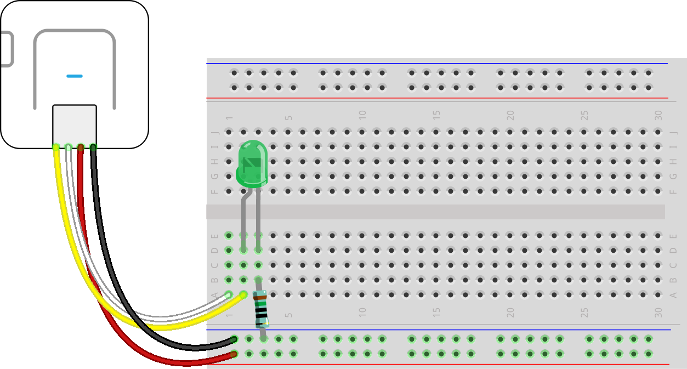

## Assignment #1 Template  

Provide a description of your initial project idea and include images of the concept sketches that you created in Part 1 of this assignment.  
  
In addition, explain the interactive behavior(s) of the prototype you are starting to work on and include a state diagram to represent it.  
  
### Formatting Tips  
   
To format text into separate lines or paragraphs with [markdown syntax](https://docs.github.com/en/get-started/writing-on-github/getting-started-with-writing-and-formatting-on-github/basic-writing-and-formatting-syntax), include at least 2 spaces at the end.  The extra spaces act as line breaks.  
  
To create a list with markdown syntax, use `-`, `*`, or `+` characters with each line of text:  
* item 1  
* item 2   
* etc.  
  
Links can be inserted with [link text in square brackets](link URL in parantheses).  For example, the markdown for [link to this page](./README.md) on GitHub is:  
`[link to this page](./README.md)`  
  
To insert images, the syntax is almost the same with the addition of exclamation point `!` before [image description in square brackets] followed by (image link in parentheses).  The image below is included with:  
`` syntax.  
  
Note the use of relative paths in links.  The dot slash `./` in link path means the file is in the current directory, `../` means that it is in parent directory, `../../` is one more directory up and so on.  
  
  
  

